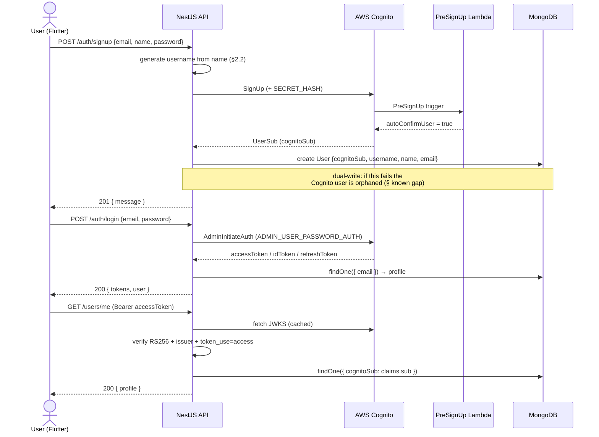
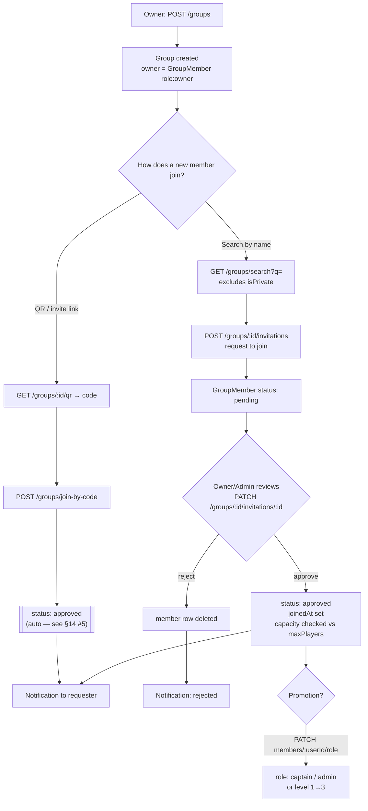
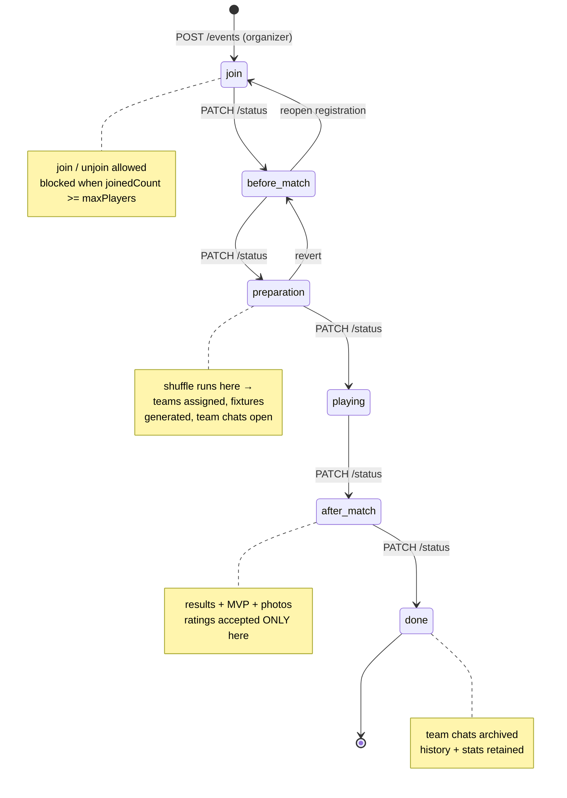
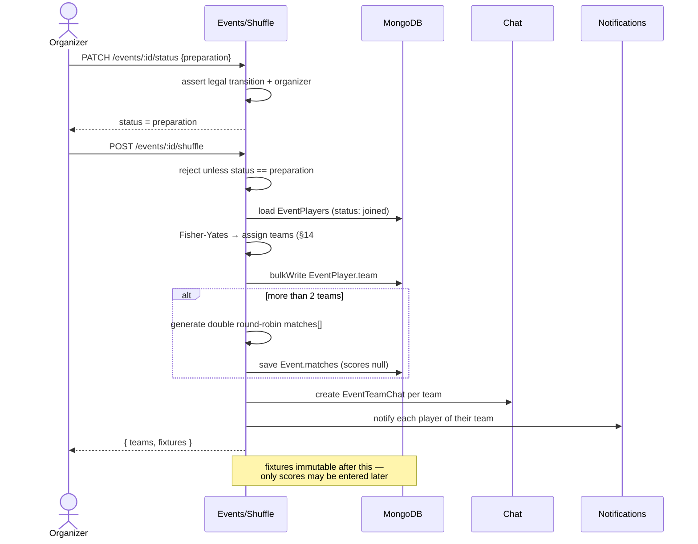
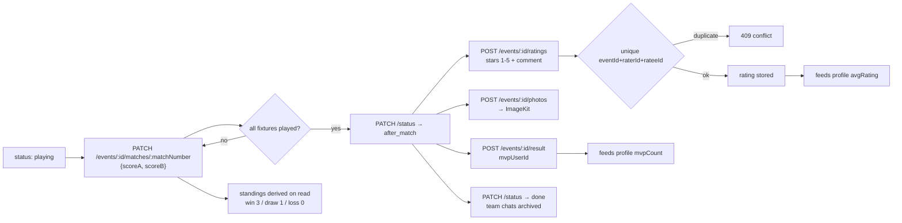
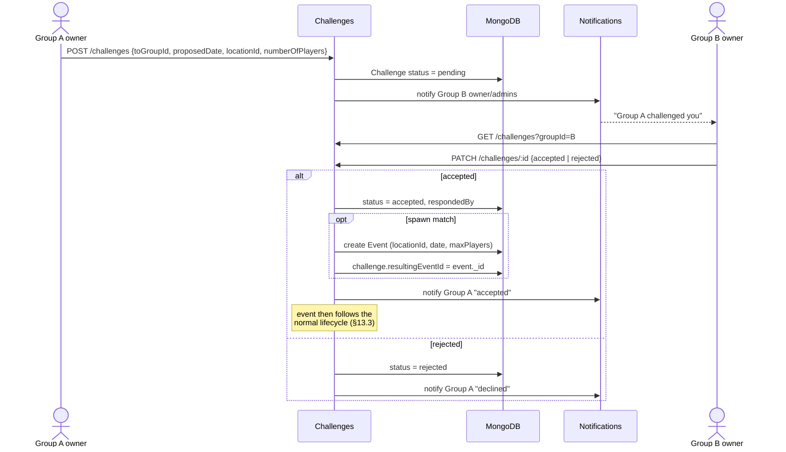
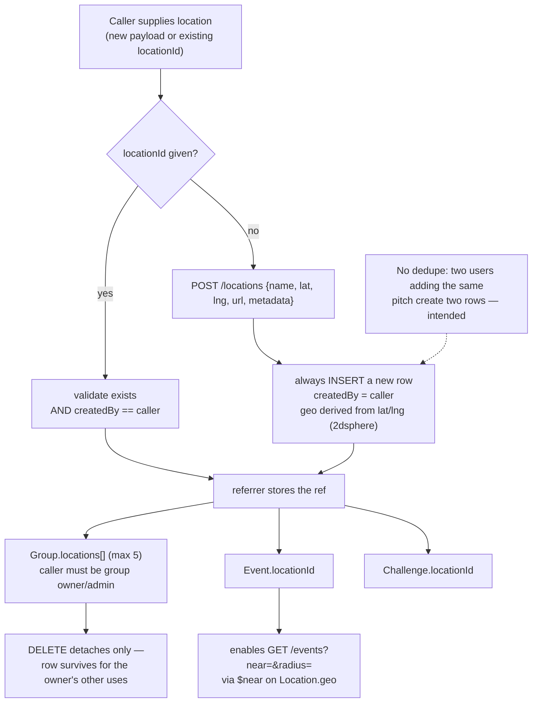
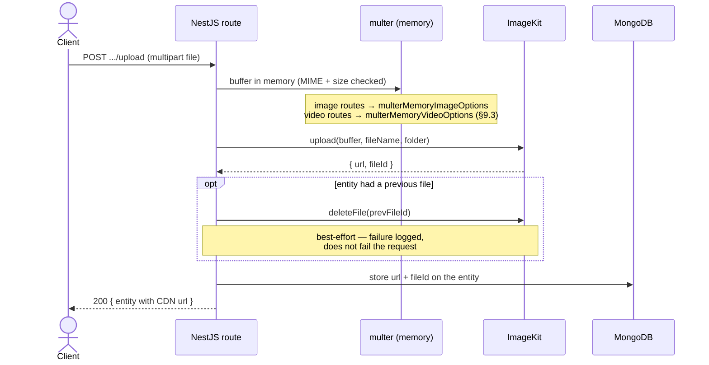

# KickR Backend — Spec v2 Changes (Gap Analysis & Change Spec) — v3

**Date:** 2026-07-28
**Supersedes:** [2026-07-24-kickr-spec-v2-changes.md](./2026-07-24-kickr-spec-v2-changes.md) (and the original 2026-07-22 version)
**Author:** Backend team
**Baseline:** [2026-06-20 KickR Backend Phase 1 Design Spec](./2026-06-20-kickr-backend-design.md)
**Drivers:** `kickr-spec-v2.pdf` + Flutter reference screenshots (`screenshots/*.png`)
**Stack:** NestJS · MongoDB (Mongoose) · Socket.io · **AWS Cognito** (auth) · **ImageKit** (file storage/CDN)

> **What changed in v3:** all "current state" sections re-verified against source on `main` (the previous version described pre-Cognito code that no longer exists); obsolete email-verification section removed; a new **`Location` collection** (§3, owned by its creator) replaces the three conflicting location models; contradictions in the group/fixture sections resolved.

---

## 0. Status — what is already shipped

Verified against source. These are **done**, not backlog:

| Area | State |
|---|---|
| **Auth** | AWS Cognito (backend-proxy). **Email + password sign-in** (PR #8). JWKS RS256 verification on HTTP + WebSocket; `token_use=access` enforced on both. Cognito owns registration, confirmation, forgot/reset, refresh. |
| **File storage** | ImageKit via shared `ImageKitService` (backend-proxied; stores CDN url + fileId; deletes prior file on replace). Avatar migrated. |
| **Player Profile (§4.2/§4.1)** | Implemented: `biography, country, city, dateOfBirth, sports[], preferredSport, footballPosition, privacy{profileVisibility,showStats,showMatchHistory}, inviteCode, highlightVideos[], gallery[]`, plus `GET /users/:id/profile` (privacy-filtered), `GET /users/me/qr`, extended `PATCH /users/me`. Stats are partial (see §2.3). |

Design docs exist for **phone-number sign-in** and **verified email change** (separate specs); not covered here.

### Verification method

Every "current state" block below was re-read from `src/` on the branch this doc lives on. Where the previous version's claims were wrong, they are corrected inline.

---

## 1. Executive Summary — Coverage Matrix

| Spec v2 area | Status today | Action |
|---|---|---|
| §4.1 User Management | **Mostly done** | Remaining: `role`, `favouriteTeam`, username autogeneration (§2.2) |
| §4.2 Player Profile | **Mostly done** | Remaining: real statistics (needs §5 + §8), gallery/highlight **upload routes** |
| §4.3 Groups | Partial | **Extend** — logo, sportType, handle, teamRules, captains, locations (§3) |
| §4.4 Group Invitations | Partial | **Add** join-by-team-name & QR; **fix** invite-link vs approval |
| §4.5 Events | Partial | **Rework** status → 6-state lifecycle; **add** MVP, multi-team fixtures, photos, cover, templates |
| §4.6 Public Events | Partial | **Add** geo discovery (enabled by §3 Location); auto-close-when-full |
| §4.7 Tournament Management | Data-model only | **Build engine** — bracket gen, league fixtures, standings, winner propagation |
| §4.8 Team Challenge | **Missing** | **Build** — new module |
| §4.9 Group Chat | Partial | **Add** attachment upload transport (ImageKit) |
| §4.10 Player Ratings | **Missing** | **Build** — new `ratings` module |
| §4.11 Financial Management | **Missing** | **Build** — new group funds module |
| **Location (cross-cutting)** | **Missing** | **Build** — new `locations` collection, creator-owned (§3) |
| Future §7 (AI matching, live tracking, push, dark mode, i18n) | Out of scope | Defer |

**Unimplemented feature areas:** Player Ratings (§4.10), Financial Management (§4.11), Team Challenge (§4.8), Location (§3). **Model-without-engine:** Tournaments (§4.7), chat attachments (§4.9).

---

## 2. Users (§4.1, §4.2)

### 2.1 Current state — VERIFIED

`src/users/schemas/user.schema.ts` has:
`cognitoSub` (unique), `name`, `username` (unique sparse), `displayName`, `email`, `phoneNumber`, `height`, `weight`, `profileImage`, `profileImageFileId`, `emailVerified`, `biography`, `country`, `city`, `dateOfBirth`, `sports[]`, `preferredSport`, `footballPosition`, `privacy{...}`, `inviteCode`, `highlightVideos[]`, `gallery[]`, timestamps.

> Correction to the previous version: `passwordHash`, `emailVerificationToken`, `passwordResetToken`, `passwordResetExpiry`, `refreshTokenVersion` were **removed** in the Cognito migration and no longer exist.

`UpdateProfileDto` accepts: name, username, displayName, phoneNumber, height, weight, biography, country, city, dateOfBirth, sports, preferredSport, footballPosition, privacy. Identity fields (`cognitoSub`, `email`, `emailVerified`, `inviteCode`, `profileImageFileId`) are deliberately **excluded** — the DTO is the write-whitelist.

### 2.2 Remaining additions to `User`

```
role: string            // enum: player | owner | admin (spec §3 target users)
favouriteTeam: string   // e.g. 'arsenal', 'manchester-united' — free string or slug enum
```

**Username autogeneration (new requirement).** Username is derived from the display name at signup rather than user-supplied:
- Slugify the name (lowercase, strip non-alphanumeric), truncate to a short prefix, append a numeric suffix. Example: `"Thar Htet"` → `thar0011002`.
- On duplicate key, regenerate the suffix and retry (bounded retries).
- `username` stays unique+sparse; users may still change it later via `PATCH /users/me` (already supported, with a conflict check).

### 2.3 Derived profile data — current reality

`GET /users/:id/profile` assembles:
- **Match history** — real, from `EventPlayer` → `Event`.
- **Statistics** — `matchesPlayed` is real; `wins`, `mvpCount`, `avgRating` currently return **0 with TODOs**, because they need Event after-match results (§5) and Ratings (§8). Wire them when those land.
- **Highlight videos / Gallery** — fields exist (`string[]` of ImageKit URLs); **upload routes are not built yet** (§9.3 covers the video multer option needed).

### 2.4 New/changed routes

| Method | Path | Change |
|---|---|---|
| PATCH | `/users/me` | **CHANGED** — additionally accept `role`, `favouriteTeam` |
| POST | `/users/me/gallery` | **NEW** — upload gallery image (ImageKit) |
| POST | `/users/me/highlights` | **NEW** — upload highlight video (ImageKit, video multer per §9.3) |

> The previous version's §2.5 ("email verification is a dead path") and the `POST /auth/confirm-email` fix are **deleted** — that code no longer exists; Cognito owns verification.

---

## 3. Location — NEW collection (cross-cutting), owned by its creator

**Problem being solved.** Location is currently modelled three inconsistent ways: flat `locationName/latitude/longitude` duplicated on `Group` and `Event`; a proposed "multilocation object array" on Group; and a proposed `/groups/:id/maps` sub-resource. A group needs **many** locations, an event needs **one**, and a challenge needs one.

**Decision.** A single `locations` collection, but **not a shared/global venue registry**. Each row is **owned by the user who created it** (`createdBy`) and is reusable **by that creator** across their own groups/events. Two users adding the same real-world pitch produce **two rows** — this duplication is **intentional and accepted** for this phase.

**Why per-user rather than global:** a shared registry raises questions this phase doesn't need to answer — who may rename or correct a venue, and whether one user's edit should change what every other group sees. Per-user ownership keeps edit permissions trivial (the creator owns their row) at the cost of duplicate rows.

**Consequence to be aware of:** geo discovery (§5.7) matches against location rows, so the same physical pitch may appear as several nearby results (one per creator). That is expected behaviour here, not a defect. If a canonical venue registry is wanted later, it is an additive change (introduce a `venueId` that locations point at) rather than a rewrite.

### 3.1 New schema `Location`

```
locations/{id}
{
  name: string              // required, e.g. "Shwe Pitch, Bangkok"
  lat: number               // required
  lng: number               // required
  geo: { type: 'Point', coordinates: [lng, lat] }   // derived from lat/lng; 2dsphere index
  url: string               // optional — Google Maps / venue link
  metadata: Mixed           // free-form, location-intrinsic extras:
                            //   e.g. { surface:'grass', indoor:false, pitches:2, parking:true, notes:'...' }
  createdBy: ObjectId->User // required — OWNER. Only this user may edit/delete.
  createdAt / updatedAt
}
```

**Indexes:** `2dsphere` on `geo` (enables §5.7 "events near me"); `createdBy` (list "my locations"); text or prefix index on `name` for search.

**Why `geo` in addition to `lat`/`lng`:** MongoDB geo queries (`$near`, `$geoWithin`) require GeoJSON with a `2dsphere` index. `lat`/`lng` stay as plain readable numbers; `geo` is derived from them in a pre-save hook so the two can't drift. Callers never set `geo` directly.

**`metadata` holds location-intrinsic extras only** (surface, indoor, pitch count, parking, notes). It should not carry relationship data (`refType`/`refId`) — which thing uses a location is expressed by the referrer holding the ref (§3.2), so one location can serve several of its creator's groups/events without a metadata rewrite.

### 3.2 How other collections reference it

| Collection | Field | Cardinality |
|---|---|---|
| `Group` | `locations: [ObjectId->Location]` | **many** — max 5 (group's home grounds / regular pitches) |
| `Event` | `locationId: ObjectId->Location \| null` | one |
| `Challenge` (§10) | `locationId: ObjectId->Location \| null` | one |

Referrers hold the ref; a location does not point back at its consumers. This is what lets one of the creator's locations be attached to several of their groups/events.

### 3.3 Ownership & reuse (no dedupe)

- **Owner:** `createdBy`. Only the owner may `PATCH`/`DELETE` a location.
- **Reuse:** the owner may attach the same location to any number of their own groups/events.
- **No dedupe.** Creating a location always inserts a new row; there is no name/proximity matching against other users' locations. Duplicates across users are expected.
- **Attach permission:** to attach a location to a group, the caller must be that group's owner/admin **and** the location's `createdBy` (i.e. you attach your own locations). *(If groups should be able to attach a co-member's location, that is a small extension — not assumed here.)*
- **Detach ≠ delete:** removing a location from a group detaches the ref only; the row survives for the owner's other uses.

### 3.4 Migration (replaces the flat fields)

Remove `locationName`, `latitude`, `longitude` from **both** `Group` and `Event` schemas and their DTOs, replacing with the refs in §3.2.

**Call sites that must be updated** (verified — 12 occurrences):
- `src/groups/schemas/group.schema.ts` (3 fields), `src/groups/dto/create-group.dto.ts` (3)
- `src/events/schemas/event.schema.ts` (3), `src/events/dto/create-event.dto.ts` (3)
- `src/users/users.service.ts:165` — match-history projection selects `locationName`; change to populate `locationId` (or select `locationId` and populate `name`).

**One-off data migration:** for each existing Group/Event with a non-empty `locationName`, insert a `Location` owned by that group's `ownerId` / event's `createdBy`, and set the ref. No dedupe — one row per source record. Rows with no location data get `null`/`[]`.

### 3.5 Routes

| Method | Path | Description |
|---|---|---|
| POST | `/locations` | Create (always inserts; `createdBy` = caller) |
| GET | `/locations` | List the caller's own locations |
| GET | `/locations/search?q=&near=&radius=` | Search by name and/or proximity |
| GET | `/locations/:id` | Detail |
| PATCH | `/locations/:id` | Update name/lat/lng/url/metadata — **owner only** |
| DELETE | `/locations/:id` | Delete — **owner only** (detaches from referrers) |
| GET | `/groups/:id/locations` | Group's locations |
| POST | `/groups/:id/locations` | Attach a location to a group (max 5; accepts an existing `locationId` or a new location payload) |
| DELETE | `/groups/:id/locations/:locationId` | Detach (does not delete the Location row) |

> Detaching from a group must **not** delete the location row — the owner's other groups/events may reference it.

---

## 4. Groups & Invitations (§4.3, §4.4)

### 4.1 Current state — VERIFIED

`Group`: `name`, `description`, `ownerId`, `wallpaper`, `locationName`, `latitude`, `longitude`, `isPrivate`, `maxPlayers`, `inviteCode`, `inviteCodeExpiry`.
`GroupMember`: `groupId`, `userId`, `role` (enum `owner|admin|member`), `status` (enum **`pending|approved`**), `joinedAt`. No separate Invitation collection — pending members ARE the invitations.

> Corrections to the previous version: Group does **not** have `country`/`city` (it has the flat location trio, being replaced per §3). GroupMember status has **no `rejected` value** — reject deletes the row.

### 4.2 Schema additions to `Group`

```
logo: string        // team logo/crest — distinct from `wallpaper` (the cover photo)
logoFileId: string  // ImageKit fileId for replace/delete
sportType: string   // enum football | futsal | padel | ... (create-group "Sport Type")
handle: string      // unique — the "@Bangkok FC" handle in the group_detail screenshot
teamRules: [string] // §4.3 "Team rules" — max 3 (see §4.6 routes)
locations: [ObjectId->Location]   // §3.2 — max 5; REPLACES locationName/latitude/longitude
```

Notes:
- `wallpaper` (existing) = the cover/banner photo. `logo` (new) = the team crest. The screenshots show both.
- `homeGround` is **not** added — it is subsumed by `locations` (§3). *(The previous version listed it and simultaneously annotated "should remove"; resolved here as: removed.)*
- `country`/`city` are **not** added to Group — derive from the referenced `Location` if needed for display/filtering.
- `isPrivate` (existing) means the group is excluded from search results (§4.5 Team Name search).

### 4.3 GroupMember — captains & member levels

Extend `role` enum to: `owner | admin | captain | member`.

**Member levels (new).** Alongside `role`, add:
```
level: number    // 1 | 2 | 3 — seniority within `member`; default 1
```

**"Plus one" rule (new).** A member at the **highest level (3)** may invite a guest ("plus one") to an event; the invite requires approval by `owner`, `admin`, or `captain` before the guest is added.

> **Open question (§14 #10):** the previous version wrote `member(eg. 1, 2, 3 level)` without defining the levels. The model above (separate `level` field, 3 = highest, can propose plus-ones) is an **assumption** — confirm the intended semantics: what distinguishes levels 1/2/3, how is level assigned/promoted, and is "plus one" per-event or per-group?

### 4.4 Group sub-content (screenshots: Events / Posts / Members / Gallery tabs)

- **Posts** → new `group_posts` collection (announcements, coaching materials). Overlaps with chat announcements (§9); **Decision needed** (§14 #4).
- **Gallery** → `gallery: [string]` (ImageKit URLs) on Group + upload route.
- **Events tab** → already served by `GET /events?groupId=`.

### 4.5 Invitations / join flow (§4.4)

Current: request-to-join (pending → owner approves), plus `inviteCode` + `join-by-code` (which **auto-approves**, bypassing owner approval).

| Join method | Status | Action |
|---|---|---|
| Team Name search | **Missing** | **Add** `GET /groups/search?q=` (excludes `isPrivate`) + request-to-join |
| Invitation Link | Partial (raw code) | **Change** to a formatted deep link wrapping `inviteCode` |
| QR Code | Partial | **Add** QR payload endpoint (encodes the invite link); client renders the QR |
| Owner approval | Present | **Fix inconsistency**: `join-by-code` auto-approves, contradicting "owners approve new members before joining". See §14 #5 |
| Challenge from other team | Missing | Covered by Team Challenge (§10) |

### 4.6 New/changed routes

| Method | Path | Change |
|---|---|---|
| GET | `/groups/search?q=` | **NEW** — search by name/handle; excludes private groups |
| POST | `/groups/:id/logo` | **NEW** — upload team logo (ImageKit) |
| PATCH | `/groups/:id` | **CHANGED** — accept `sportType`, `handle`, `teamRules` |
| GET | `/groups/:id/qr` | **NEW** — QR/invite-link payload |
| PATCH | `/groups/:id/members/:userId/role` | **NEW** — promote to captain/admin, set `level` |
| GET/POST | `/groups/:id/posts` | **NEW** (if Posts is a separate feed — §14 #4) |
| POST | `/groups/:id/gallery` | **NEW** — upload gallery media (ImageKit) |
| GET/POST/DELETE | `/groups/:id/rules` | **NEW** — team rules, **max 3** |
| GET/POST/DELETE | `/groups/:id/locations` | **NEW** — see §3.5, **max 5** |

---

## 5. Events & Lifecycle (§4.5, §4.6)

### 5.1 Current state — VERIFIED

`Event`: `title`, `description`, `date`, `groupId`, `isPublic`, `createdBy`, `locationName`, `latitude`, `longitude`, `maxPlayers`, `joinedCount`, `sportType`, `skillLevel`, `price`, `status` (**`open|full|done`**), timestamps.
`EventPlayer`: `eventId`, `userId`, `joinedAt`, `team`, `position`, `status` (`joined|cancelled`), `checkInTime`.

The current `status` is a **capacity model** (auto open↔full on join/leave; `done` never set) — NOT the spec lifecycle.

### 5.2 Status rework — lifecycle (§4.5 table)

Replace the capacity-based enum. Capacity becomes derived (`joinedCount >= maxPlayers`), not a status.

```
status enum: join | before_match | preparation | playing | after_match | done
```

| Status | Meaning | Allowed actions |
|---|---|---|
| `join` | Registration open | join / **unjoin** |
| `before_match` | Registration closed, awaiting match time | organizer finalizes; no new joins |
| `preparation` | Teams generated, lineups finalized, **team chats open**, **fixtures generated** | shuffle runs here |
| `playing` | Match in progress | per-fixture scores entered |
| `after_match` | Match ended | results, **MVP**, **ratings**, photos |
| `done` | Archived | team chats archived; history/stats retained |

Transitions are **manual and organizer-gated** (`PATCH /events/:id/status`) with a legal-transition table; no scheduler. "Unjoin" is an action valid only in `join`, not a state.

> A full task-by-task plan for this rework already exists: `docs/superpowers/plans/2026-07-23-event-lifecycle-rework.md`.

### 5.3 Multi-team fixtures & results

**Gap.** A single `scoreA`/`scoreB` can't represent the event-results screen, which shows a **4-team double round-robin**: four colour-named teams (Red, Yellow, Blue, Black), each playing 6 matches, **12 fixtures total within one event**, each with an independent result.

**Format clarification:** this is a **double round-robin** — with 4 teams there are 6 unique pairings, and each pairing is played **twice** (matches 1–6, then repeated as 7–12). Each team therefore plays 6 matches. The repeated pairings in the fixture list are intentional, not a transcription error.

| Match | Team A | Team B | | Match | Team A | Team B |
|---|---|---|---|---|---|---|
| 1 | Red | Yellow | | 7 | Yellow | Red |
| 2 | Blue | Black | | 8 | Blue | Black |
| 3 | Black | Red | | 9 | Black | Red |
| 4 | Blue | Yellow | | 10 | Blue | Yellow |
| 5 | Yellow | Black | | 11 | Yellow | Black |
| 6 | Blue | Red | | 12 | Blue | Red |

**Schema — `EventMatch`, embedded as `Event.matches[]`:**

```
matches: [{
  matchNumber: number       // 1..N, fixed order
  teamA: string             // team id assigned during shuffle, e.g. colour
  teamB: string
  scoreA: number | null     // null until played (UI renders a dash)
  scoreB: number | null
  playedAt: Date | null
}]
```

**Scoring:** win = 3, draw = 1, loss = 0 — same scheme as league standings (§6.2). Standings are **derived on read** from `matches[]`, never stored.

**Rules:**
1. Fixtures are generated **once**, on entry to `preparation`, alongside team shuffle (§5.6) — immutable afterward except score entry.
2. Generation must give every team an equal number of matches (4 teams → 6 each, 12 total).
3. Scores stay `null` until played, then set via `PATCH /events/:id/matches/:matchNumber`.

**Relationship to `Event.result` (resolved):** for multi-team events, `matches[]` is the **sole source of truth for scores**. `Event.result` retains only `mvpUserId` (plus an optional overall summary for simple 2-team events). The two must not both carry authoritative scores.

### 5.4 Schema additions to `Event`

```
locationId: ObjectId->Location | null   // §3 — REPLACES locationName/latitude/longitude
startTime: Date                          // spec separates Match date + Time
endTime: Date
coverImage: string                       // event_detail cover
coverImageFileId: string                 // ImageKit fileId
result: {
  mvpUserId: ObjectId->User              // §4.5 MVP selection
  scoreA: number | null                  // optional, simple 2-team events only
  scoreB: number | null
}
matches: EventMatch[]                    // §5.3 — authoritative scores for multi-team
photos: [string]                         // after-match photos (ImageKit)
templateId: ObjectId | null              // §5.5
```

### 5.5 Event templates

New `event_templates` collection: saved defaults (title, locationId, maxPlayers, price, sportType, recurrence hint) owned by a user/group. `POST /events` accepts optional `templateId` to prefill; `POST /event-templates` to save.

### 5.6 Shuffle integration (preparation)

Current `shuffle.service.ts` chunks joined players into random groups of 6, notifies them, and is **not** tied to the lifecycle.

- **Gate to `preparation`** — reject otherwise.
- **Team balancing** — currently pure-random buckets of 6. **Decision needed** (§14 #6): keep random, balance by `skillLevel`/`footballPosition`, or fixed N colour teams.
- **Fixture generation** — when the event has >2 teams, generate `matches[]` (§5.3) in the same transition.
- **Team chats** — create per-team rooms (`eventId`+`team`); archive on `done`.

### 5.7 Public events / discovery (§4.6)

- **Geo query** — `GET /events?near=<lat>,<lng>&radius=` via the `2dsphere` index on `Location.geo` (§3.1), joining through `locationId`. This is why Location carries GeoJSON.
- **Auto-close when full** — block joins at capacity, tied to the `join` state (not a `full` status).

### 5.8 New/changed routes

| Method | Path | Change |
|---|---|---|
| PATCH | `/events/:id` | **NEW** — edit event (organizer) |
| DELETE | `/events/:id` | **NEW** — cancel/delete (organizer) |
| PATCH | `/events/:id/status` | **NEW** — advance lifecycle |
| POST | `/events/:id/result` | **NEW** — submit MVP (+ optional overall score) |
| PATCH | `/events/:id/matches/:matchNumber` | **NEW** — submit a fixture's score (§5.3) |
| POST | `/events/:id/photos` | **NEW** — after-match photos (ImageKit) |
| POST | `/events/:id/cover` | **NEW** — cover image (ImageKit) |
| GET | `/events?near=&radius=` | **CHANGED** — geo discovery via Location |
| POST | `/events/:id/like` | **NEW** — event_detail "Like" |
| POST/GET | `/event-templates` | **NEW** |
| POST | `/events/:id/shuffle` | **CHANGED** — gated to `preparation`; creates team chats; generates fixtures |

---

## 6. Tournaments (§4.7) — build the engine

### 6.1 Current state — VERIFIED

`Tournament`, `TournamentTeam`, `TournamentMatch` exist (with `nextMatchId`, `type: knockout|league`), but `tournaments.service.ts` has **no bracket generation, no league fixtures, no standings, no winner propagation**. `winnerId` is client-supplied; `nextMatchId` never advances; `status` never leaves `registering`. Match status enum: `scheduled | in_progress | completed | walkover`.

### 6.2 Changes

**Knockout:** `generateKnockoutBracket()` — seed, build rounds, create matches, wire `nextMatchId`, handle byes. On completion, compute `winnerId` from scores and **propagate** to the next match; mark `finished` when the final completes.

**League:** `generateLeagueSchedule()` — round-robin fixtures. **Standings** as a points table (played/W/D/L/GF/GA/GD/points) using **win 3 / draw 1 / loss 0** (same as §5.3). Winner = top of standings when all matches complete. Storage: recomputed collection vs computed-on-read — **Decision needed** (§14 #7).

**Status lifecycle:** `registering → ongoing` on generate; `ongoing → finished` on completion.

### 6.3 New/changed routes

| Method | Path | Change |
|---|---|---|
| GET | `/tournaments` | **NEW** — list (filter by group/status) |
| POST | `/tournaments/:id/generate` | **NEW** — bracket or fixtures |
| GET | `/tournaments/:id/standings` | **NEW** |
| PATCH | `/tournaments/:id/matches/:matchId` | **CHANGED** — propagate winner, advance status |
| GET | `/tournaments/:id` | keep |

---

## 7. Public Events / Discovery (§4.6)

Covered by §5.7 (geo query via `Location.geo`) and §5.2 (capacity tied to `join` state).

---

## 8. Player Ratings (§4.10) — NEW module

### 8.1 Schema `Rating`

```
ratings/{id}
{
  eventId: ObjectId->Event
  raterId: ObjectId->User
  rateeId: ObjectId->User
  stars: number        // 1..5
  comment: string
  createdAt: Date
}
```

**Constraint:** unique compound index `{ eventId, raterId, rateeId }` — one rating per rater→ratee per event. (Cardinality interpretation: **Decision needed**, §14 #8.)

**Gating:** only accepted while event `status == after_match`.

### 8.2 Routes

| Method | Path | Description |
|---|---|---|
| POST | `/events/:id/ratings` | Submit (after_match; rater & ratee both joined) |
| GET | `/users/:id/ratings` | Aggregate (avg stars, count) for profile |
| GET | `/events/:id/ratings` | Ratings for a match (MVP/summary) |

Feeds the `avgRating` stat currently stubbed at 0 (§2.3).

---

## 9. Chat (§4.9) — attachment transport

### 9.1 Current state — VERIFIED

`Message` is **only** `{ groupId, senderId, text }`. Real-time works via `chat.gateway.ts` (Socket.io, **Cognito JWKS** handshake, room-per-group, membership-checked, `cognitoSub`→Mongo `_id` translation). History via `GET /groups/:id/messages`.

### 9.2 Changes

```
type: enum text | image | video | file    // default text
attachmentUrl: string                      // ImageKit CDN url
attachmentFileId: string                   // ImageKit fileId
attachmentMeta: { name, size, mimeType }
```

- **Upload transport:** `POST /groups/:id/messages/attachment` (member-only) → `ImageKitService` → returns url + fileId → client sends `sendMessage` with `type` + `attachmentUrl`. Extend the gateway payload accordingly.
- **Announcements:** add `isAnnouncement` / pinned flag (owner/admin). Overlaps with Posts (§4.4) — §14 #4.
- **Team chats:** scope rooms to `eventId`+`team` during `preparation`; archive on `done`.

### 9.3 Video uploads

Video goes to **ImageKit** (handles video natively). The existing `multerMemoryImageOptions` is image-MIME-only — add a sibling **`multerMemoryVideoOptions`** (video MIME allowlist, larger size cap) reusing `ImageKitService.upload`. Needed by chat video, highlight videos (§2.4), and coaching materials.

---

## 10. Team Challenge (§4.8) — NEW module

```
challenges/{id}
{
  fromGroupId: ObjectId->Group
  toGroupId: ObjectId->Group
  proposedDate: Date
  locationId: ObjectId->Location | null   // §3
  numberOfPlayers: number
  status: enum pending | accepted | rejected | cancelled
  createdBy: ObjectId->User
  respondedBy: ObjectId->User | null
  resultingEventId: ObjectId->Event | null
}
```

| Method | Path | Description |
|---|---|---|
| POST | `/challenges` | Create (challenger owner/admin) |
| GET | `/challenges?groupId=` | Incoming/outgoing for a group |
| PATCH | `/challenges/:id` | Accept / reject (challenged owner/admin) — notifies challenger |

On accept: notify, optionally spawn the match event.

---

## 11. Financial Management (§4.11) — NEW module

```
group_funds/{groupId}                fund_transactions/{id}
{                                    {
  groupId (unique)                     groupId, type: contribution|expense
  balance: number                      amount: number
  currency: string                     category: football|jersey|training_bib|
}                                                equipment|ground_rental|fee|other
                                       eventId | null, userId | null
                                       note, createdBy, createdAt
                                     }
```

Balance = Σ contributions − Σ expenses. Event `price` can auto-create a contribution on join.

**Scope: bookkeeping ledger only.** The module records money that changes hands offline (cash/bank transfer); it does **not** integrate a payment gateway. Collecting real payments (gateway, webhooks, refunds, payouts) is out of scope for this change set.

| Method | Path | Description |
|---|---|---|
| GET | `/groups/:id/fund` | Balance + summary (members) |
| GET | `/groups/:id/fund/transactions` | Ledger (members) |
| POST | `/groups/:id/fund/transactions` | Record entry (owner/admin) |

---

## 12. Notifications — broaden triggers

Current: `{ userId, title, body, type, refId, isRead }`; the **only** trigger is the shuffle service.

Add: invitation requested/approved/rejected; challenge received/accepted/rejected; event lifecycle transitions (incl. after_match "rate your teammates"); tournament match scheduled / result posted. Extend `type` enum with `challenge`, `rating`, `tournament`.

---

## 13. Workflows & Scenarios

End-to-end flows for the main journeys. These encode the gating rules stated elsewhere in this doc — where a diagram and prose disagree, the prose section is authoritative.

### 13.1 User signup & first login (Cognito)

Email + password sign-in. A PreSignUp Lambda auto-confirms users (bypassing email-code delivery); Cognito remains the identity source of truth, Mongo holds the profile.



### 13.2 Group creation → member invitation → approval

Covers all three join paths (§4.5). Note the open question on whether invite-link joins should require approval (§14 #5) — shown as the *current* auto-approve behaviour.



### 13.3 Event lifecycle (creation → done)

The 6-state machine from §5.2. Transitions are manual and organizer-gated; capacity is derived, not a state.



### 13.4 Team shuffle & fixture generation (preparation)



### 13.5 Match results, MVP & ratings (playing → after_match)



### 13.6 Team challenge (group vs group)



### 13.7 Location attach (creator-owned)

How any collection attaches a location (§3.3). No dedupe — creating always inserts.



### 13.8 File upload (ImageKit, backend-proxied)

Applies to avatar, group logo/wallpaper/gallery, event cover/photos, chat attachments, highlight videos.



---

## 14. Open Decisions

| # | Decision | Status |
|---|---|---|
| 1 | Email verification | ✅ RESOLVED — Cognito |
| 2 | OAuth (Google/Facebook) | ✅ RESOLVED — stubs removed; can add via Cognito IdPs later |
| 3 | Highlight/gallery storage | ✅ RESOLVED — ImageKit. Sub-question: arrays vs a `media` collection if per-item metadata is needed |
| 4 | **Group Posts vs chat announcements** — separate feed, or pinned messages? | OPEN |
| 5 | **Invite-link approval** — should join-by-link/QR still require owner approval? (currently auto-approves) | OPEN |
| 6 | **Shuffle strategy** — random buckets of 6, skill/position-balanced, or fixed N colour teams? Note §5.3 assumes colour teams | OPEN |
| 7 | **League standings storage** — recomputed collection vs computed-on-read | OPEN |
| 8 | **Ratings cardinality** — one per match total, or one per teammate per match? | OPEN |
| 9 | Chat/video upload limits & storage | ✅ RESOLVED — ImageKit |
| 10 | **Member levels & "plus one"** — what do levels 1/2/3 mean, how are they assigned, is plus-one per-event or per-group? (§4.3) | OPEN |

---

## 15. Suggested Build Order

1. **Location collection (§3)** — foundational; unblocks group multi-location, event geo discovery, and challenge location. Do first because Group/Event schema changes depend on it.
2. **Group field extensions (§4)** — logo, sportType, handle, rules, captains/levels, locations.
3. **Event lifecycle rework (§5)** — biggest behavioural change; unblocks ratings, stats, team chats. *(Plan already written: `2026-07-23-event-lifecycle-rework.md`.)*
4. **Multi-team fixtures (§5.3)** — extends the lifecycle work; do in the same pass as shuffle.
5. **Player Ratings (§8)** — depends on `after_match`; then wire the stubbed profile stats.
6. **Tournament engine (§6)** — self-contained.
7. **Team Challenge (§10)** + **Financial (§11)** — independent modules.
8. **Chat attachments (§9)** + **Notification triggers (§12)** + gallery/highlight upload routes (§2.4).

Future §7 items (AI matching, live tracking, GPS check-in, push, dark mode, i18n, referee management, badges) remain **out of scope**.

---

## 16. Collections — target vs current

| Collection | Current | After changes |
|---|---|---|
| users | ✅ (add role, favouriteTeam) | ✅ |
| notifications | ✅ | ✅ (more triggers) |
| groups | ✅ (extend; locations ref) | ✅ |
| group_members | ✅ | ✅ (+captain role, +level) |
| messages | ✅ | ✅ (+attachments) |
| events | ✅ (rework status; +matches[], locationId) | ✅ |
| tournaments / teams / matches | ✅ (add engine) | ✅ |
| **locations** | ❌ | ✅ **new** (§3) |
| ratings | ❌ | ✅ **new** (§8) |
| challenges | ❌ | ✅ **new** (§10) |
| group_funds / fund_transactions | ❌ | ✅ **new** (§11) |
| event_templates | ❌ | ✅ **new** (§5.5) |
| group_posts | ❌ | maybe (§14 #4) |
| tournament_standings | ❌ | maybe (§14 #7) |
